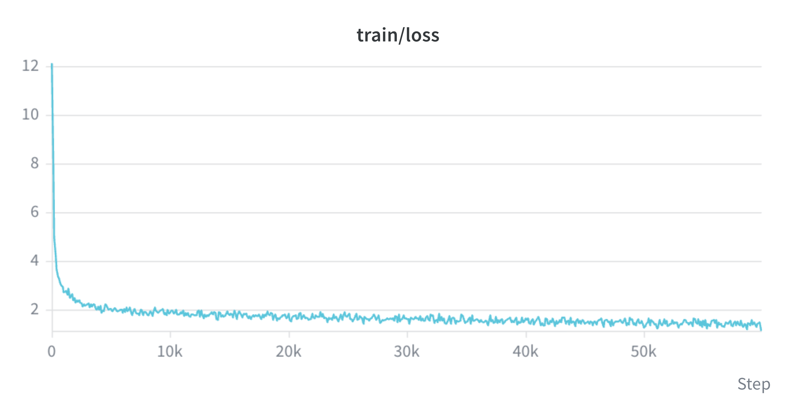
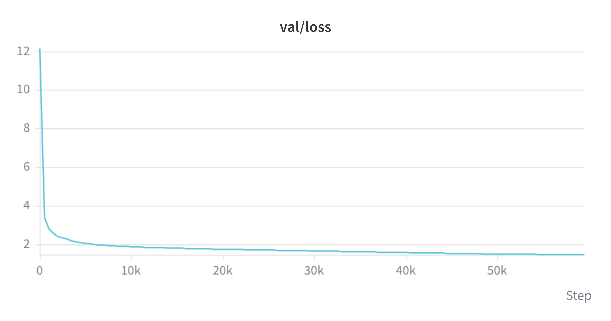
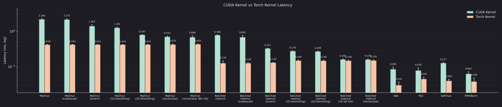
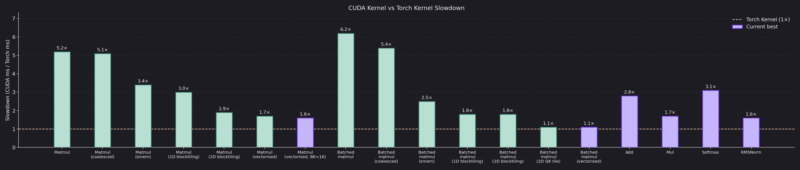
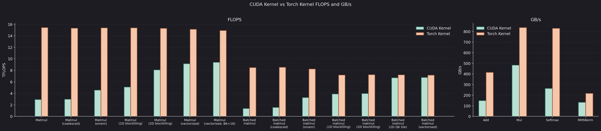

# CUDA Transformer

A from-scratch [Qwen-3](https://arxiv.org/abs/2505.09388) style decoder. After that, a second pass: swap PyTorch ops for my own CUDA kernels, then make those kernels fast.

I train on [TinyStories](https://arxiv.org/abs/2305.07759) with the Qwen3 tokenizer. There is a PyTorch reference model and a CUDA-backed twin with kernels dropped in one at a time.

The current mini config is 12 layers, dim 1024, GQA 16/8, SwiGLU FFN, RMSNorm, QK-norm, RoPE, and tied embeddings. Context is 256.

Deeper write-ups will live in blogs. This README is just where things stand today.

## Training so far

PyTorch backend, DDP on 4 A100s, ~60k steps, ~300M tokens. Train and val loss both fall from ~12 to about **1.5–1.7**.

## Kernels so far

The kernels I have wired in (add, mul, SiLU, matmul, batched matmul, RMSNorm, softmax) match PyTorch numerically. They are still slower.

On GEMM I have gone naive → coalesced loads → shared-memory tiling → 1D blocktiling → 2D blocktiling → vectorised loads. Batched matmul uses a smaller QK-specific tile (`BM=BN=64 TM=TN=4 BK=32`) instead of the FFN 128×128 tile. Current best vs PyTorch, timed with CUDA events on the same shapes as the mini model:

| Kernel | Slowdown |
| --- | ---: |
| Batched matmul (vectorised, QK tile) | 1.1× |
| RMSNorm | 1.6× |
| Mul | 1.7× |
| Matmul (vectorised, BK=16) | 1.6× |
| Add | 2.8× |
| Softmax | 3.1× |

Layer 1 (Nsight Systems) is started. Layer 2 (Nsight Compute) and the actual optimisation write-ups will go in my blogs walking through everything in a deeper detail.

## Things TODO

This repo is not in its final form just yet! Next on GEMM is Nsight Compute on the vectorised kernels (BK, bank conflicts, double buffering), then the other kernels.
