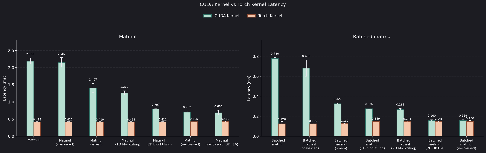
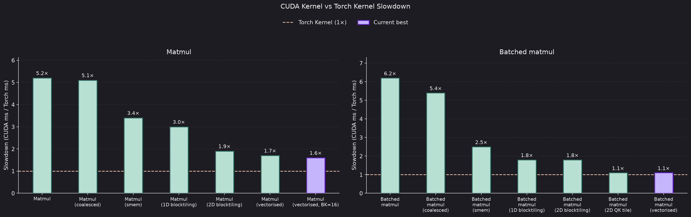
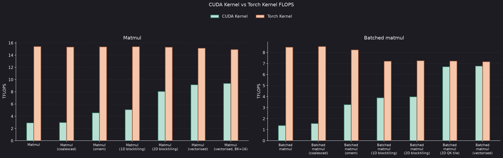
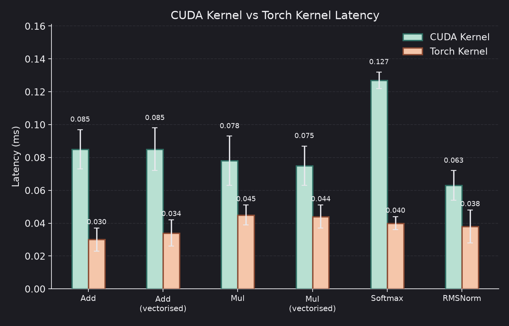
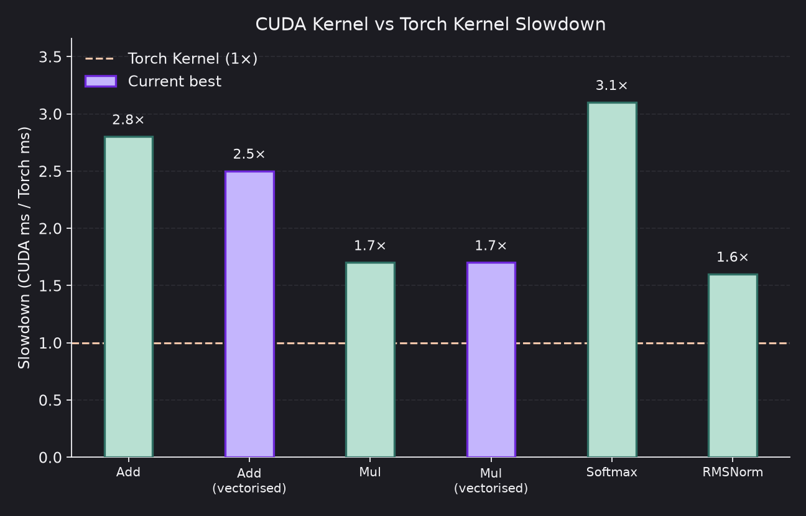
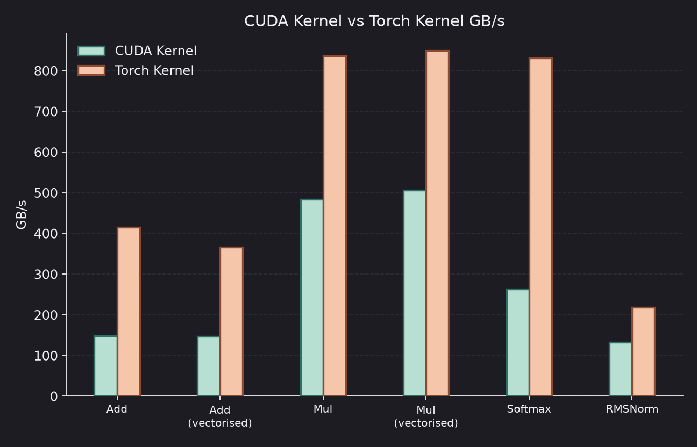

# CUDA Transformer

A from-scratch [Qwen-3](https://arxiv.org/abs/2505.09388) style decoder. After that, a second pass: swap PyTorch ops for my own CUDA kernels, then make those kernels fast.

I train on [TinyStories](https://arxiv.org/abs/2305.07759) with the Qwen3 tokenizer. There is a PyTorch reference model and a CUDA-backed twin with kernels dropped in one at a time.

The current mini config is 12 layers, dim 1024, GQA 16/8, SwiGLU FFN, RMSNorm, QK-norm, RoPE, and tied embeddings. Context is 256.

Deeper write-ups will live in blogs. This README is just where things stand today.

## Training so far

PyTorch backend, DDP on 4 A100s, ~60k steps, ~300M tokens. Train and val loss both fall from ~12 to about **1.5–1.7**.

## Kernels so far

The kernels I have wired in (add, mul, SiLU, matmul, batched matmul, RMSNorm, softmax) match PyTorch numerically. They are still slower than PyTorch. Layer 0 numbers below are CUDA events vs the PyTorch sibling, on the mini-model shapes.

On GEMM I have gone naive → coalesced loads → shared-memory tiling → 1D blocktiling → 2D blocktiling → vectorised loads. Batched matmul uses a smaller QK-specific tile (`BM=BN=64 TM=TN=4 BK=32`) instead of the FFN 128×128 tile.

### Matmul

FFN `(1024, 1024) @ (1024, 3072)` and attention QK `(64, 256, 128) @ (64, 128, 256)`.

| Kernel | Slowdown |
| --- | ---: |
| Batched matmul (vectorised, QK tile) | 1.1× |
| Matmul (vectorised, BK=16) | 1.6× |

### Other kernels

Add, mul, softmax, and RMSNorm. These are bandwidth-bound, so throughput is GB/s rather than TFLOPS.

Vectorised `float4` loads move four elements per thread. Layer 0 did not move (the 2.8× → 2.5× on add is within noise). Nsight Systems shows add and mul are launch-bound at the mini-model shape, so we are moving on from them for now; they will mainly benefit from kernel fusion.

| Kernel | Slowdown |
| --- | ---: |
| RMSNorm | 1.6× |
| Mul | 1.7× |
| Mul (vectorised) | 1.7× |
| Add | 2.8× |
| Add (vectorised) | 2.5× |
| Softmax | 3.1× |

Layer 1 (Nsight Systems) is started. Layer 2 (Nsight Compute) and the actual optimisation write-ups will go in my blogs walking through everything in a deeper detail.

## Things TODO

This repo is not in its final form just yet! Next on GEMM is Nsight Compute on the vectorised kernels (BK, bank conflicts, double buffering), then the other kernels.
